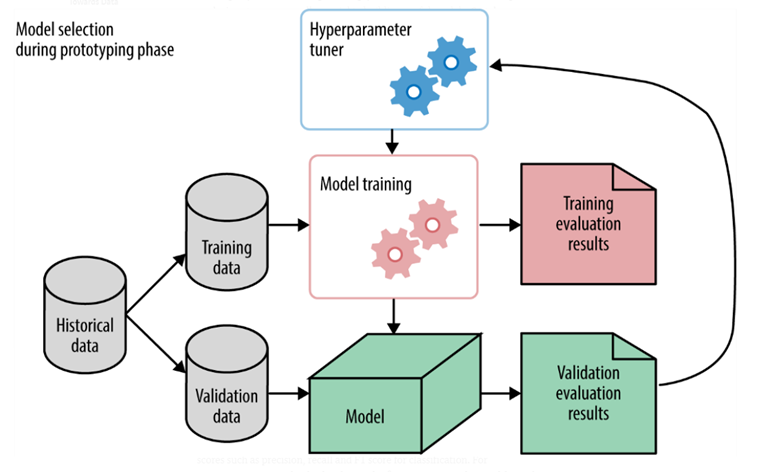

  

This script present training pipline for classifer based on Resnet18 MobileNet v2-3.

The main idea the train pipline is wrapped by Optuna.  
  
Optuna is optimizator hyperparametrs on based Bayesian Optimization.  


```
def objective(trial,device=device,
                classes=classes, 
                path_allresult=path_allresult...)

    ##### Hyper-parametrs for tuning wrapped function ##### 
    lr = trial.suggest_float("lr", 1e-4, 1e-2, step=step)
    batch_size = trial.suggest_int("batch_size", 32, 256, step=16)
    epochs= trial.suggest_int("epochs", 30, 140, step=10)


study = optuna.create_study(study_name="pytorch_checkpoint",direction="minimize")
study.optimize(objective, n_trials=30)
```
***direction***  = "minimize"/"maximize" Optuna can maximize or minimize the parametrs, it sets by  *optuna.create_study( ..)*  
***trial*** = amount of expirements  
***path_allresult*** = path where saved all results  
Example ***path_allresult***:  

```
     path_allresult:
        local_dir/ 
        ├──seat_belt_2021-08-31_13-11-00/
        │  ├──844q7v8g_btach=192_lr=0.0012_epochs=100/
        │  │  ├──<checkpoint_001.pth>
        │  │  ├──<checkpoint_002.pth>
        │  │  ├──<checkpoint_003.pth>
        │  │  ├──  ...
        │  │  └──<checkpoint_100.pth>
        │  │ 
        │  ├──1i8g864z_btach=32_lr=0.003_epochs=140/
        │  │  ├──<checkpoint_001.pth>
        │  │  ├──<checkpoint_002.pth>
        │  │  ├──<checkpoint_003.pth>
        │  │  ├──  ...
        │  │  └──<checkpoint_140.pth>
        │  └── .......
        │
        │
        ├──seat_belt_2021-08-31_13-07-05/
        │  │ 
        │  ├──945q1i1g_btach=256_lr=0.0098_epochs=220/
        │  │  ├──<checkpoint_001.pth>
        │  │  ├──<checkpoint_002.pth>
        │  │  ├──<checkpoint_003.pth>
        │  │  ├──  ...
        │  │  └──<checkpoint_220.pth>
        │  │ 
        │  ├──xyu25w8g_btach=16_lr=0.01_epochs=40/
        │  │  ├──<checkpoint_001.pth>
        │  │  ├──<checkpoint_002.pth>
        │  │  ├──<checkpoint_003.pth>
        │  │  ├──  ...
        │  │  └──<checkpoint_400.pth>
        └─.................
```


